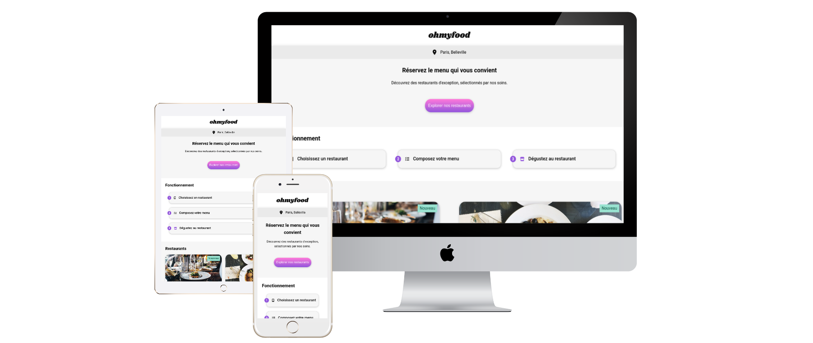

# 🍽️ OhMyFood

**OhMyFood** est une application web responsive qui permet aux clients de composer leur menu gastronomique à l’avance et de réduire leur temps d’attente dans les restaurants partenaires.

---



---

## 🚀 Aperçu rapide

- **4 restaurants parisiens** avec menus interactifs
- **Animations CSS élégantes** et micro-interactions
- **100% mobile-first** et accessible
- **Aucune dépendance JS** : HTML & CSS pur

---

## 🗂️ Dépôt GitHub

- [Branche principale](https://github.com/Steinshy/OC-OhMyFood/tree/main)

---

## 🏗️ Structure du projet

```
OhMyFood/
├── assets/
│   ├── css/           # Feuilles de style CSS du projet
│   │   ├── animation.css     # Animations CSS
│   │   ├── restaurants.css   # Styles spécifiques aux pages restaurants
│   │   └── style.css         # Styles généraux du site
│   ├── favicons/      # Icônes favicon du site
│   ├── img/           # Images utilisées dans le site
│   │   ├── logo/          # Logos OhMyFood (png, svg)
│   │   └── restaurants/   # Images des restaurants
│   │       ├── jpg/           # Images des restaurants au format JPG
│   │       └── webp/          # Images des restaurants au format WebP
│   ├── restaurants/      # Pages HTML individuelles des restaurants
│   │   ├── delice.html      # Page du restaurant Le Délice des Sens
│   │   ├── francaise.html   # Page du restaurant La note enchantée
│   │   ├── note.html        # Page du restaurant La palette du goût
│   │   └── palette.html     # Page du restaurant La française gourmande
│   ├── screenshots/      # Captures d'écran du projet
│   └── manifest.json     # Fichier manifest pour PWA
├── index.html         # Page d'accueil
└── README.md          # Documentation
```

---

## 🛠️ Technologies

- **HTML5** (sémantique, BEM)
- **CSS3** (variables, animations, responsive)
- **Font Awesome 6** (icônes)
- **WebP/JPEG** (images optimisées)
- **PWA** (manifest)

---

## 📱 Responsive Design

| Appareil | Point de rupture | Disposition           |
| -------- | ---------------- | --------------------- |
| Mobile   | < 768px          | Colonne unique        |
| Tablette | 768px–1024px     | Grille adaptée        |
| Desktop  | > 1024px         | Mise en page complète |

---

## ✨ Fonctionnalités principales

- **Composition de menu en avance**
- **Animations et transitions CSS**
- **Accessibilité renforcée** (ARIA, navigation clavier, contrastes)
- **Optimisation mobile et images**
- **Aucune dépendance JavaScript**

---

## ♿ Accessibilité

- Structure HTML sémantique
- Attributs ARIA et labels explicites
- Navigation clavier complète
- Indicateurs de focus visibles
- Texte alternatif pour toutes les images

---

## 🚀 Démarrage rapide

1. Clone le dépôt
2. Ouvre `index.html` dans ton navigateur
3. Profite de l’expérience OhMyFood !

---

## 🍴 Restaurants disponibles

- **La palette du goût** – Ménilmontant
- **Le délice des sens** – Folie-Méricourt
- **La note enchantée** – Charonne
- **À la française** – Cité Rouge

---

## 🔗 Liens utiles

- [Maquette Figma](https://www.figma.com/design/t4449fzDnwGYmzuwQdu87V/Maquettes-Ohmyfood--mobile-et-desktop-?node-id=0-1&p=f&t=Jk9BTbzoDrFkhTee-0)
- [Prototype Figma](https://www.figma.com/proto/t4449fzDnwGYmzuwQdu87V/Maquettes-Ohmyfood--mobile-et-desktop-?node-id=25368-591&scaling=scale-down&page-id=0%3A1&starting-point-node-id=25368%3A591&show-proto-sidebar=1)
- [Fichiers Source](https://course.oc-static.com/projects/D%C3%A9veloppeur+Web/IW_P4+Animations+CSS+Ohmyfood/Images+et+textes+Ohmyfood.zip)
- [Scénario du projet](https://openclassrooms.com/fr/paths/877/projects/637/704-scenario)
- [Brief créatif](https://course.oc-static.com/projects/D%C3%A9veloppeur+Web/IW_P4+Animations+CSS+Ohmyfood/Brief+cr%C3%A9atif+site+Ohmyfood.pdf)
- [Font Awesome 6.7.2](https://cdnjs.cloudflare.com/ajax/libs/font-awesome/6.7.2/css/all.min.css)
- [Validateur W3C](https://validator.w3.org/)

---

## 🎨 Design System

- **Police principale** : Roboto
- **Police titre** : Shrikhand
- **Couleurs** :
  - Primaire : #9356DC
  - Secondaire : #FF79DA
  - Tertiaire : #99E2D0

---

## 📄 Licence

Projet réalisé à des fins pédagogiques dans le cadre du parcours Développeur Web d’OpenClassrooms.
