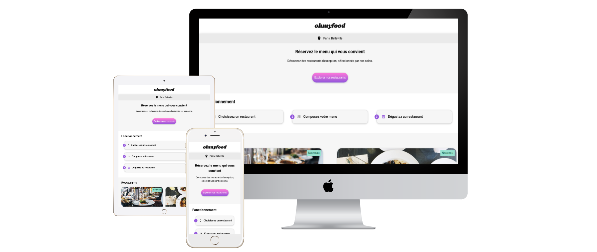

# OhMyFood

[](https://developer.mozilla.org/en-US/docs/Web/HTML)
[](https://developer.mozilla.org/en-US/docs/Web/CSS)
[](https://developer.mozilla.org/en-US/docs/Web/Progressive_web_apps)
[](https://fontawesome.com/)
[](https://fonts.google.com/)

OhMyFood est une application web responsive qui permet aux clients de composer leur menu gastronomique à l'avance et de réduire leur temps d'attente dans les restaurants partenaires.



## Démonstration

- 🌐 **Demo :** [https://steinshy.github.io/OC-OhMyFood/](https://steinshy.github.io/OC-OhMyFood/)
- 📦 **GitHub :** [https://github.com/Steinshy/OC-OhMyFood](https://github.com/Steinshy/OC-OhMyFood)

## Structure du projet

```text
OC-OhMyFood/
├── css/                   # Feuilles de style CSS (+ versions .min.css générées)
│   ├── animation.css      # Animations CSS
│   ├── loader.css         # Styles du loader
│   ├── restaurants.css    # Styles spécifiques aux pages restaurants
│   └── style.css          # Styles généraux du site
├── favicons/              # Icônes de l'application
├── restaurants/           # Images des restaurants (JPG - webp)
├── delice.html            # Page du restaurant Le délice des sens
├── francaise.html         # Page du restaurant À la française
├── index.html             # Page principale
├── note.html              # Page du restaurant La note enchantée
├── palette.html           # Page du restaurant La palette du goût
├── manifest.json          # Manifest PWA
├── robots.txt             # Fichier robots.txt
├── sitemap.xml            # Sitemap XML
└── README.md              # Documentation
```

## Technologies

- **HTML5** - Structure sémantique et accessible
- **CSS3** - Animations et responsive design
- **Font Awesome 6.7.2** - Icônes vectorielles
- **Google Fonts** - Roboto & Shrikhand avec display=swap
- **PWA** - Progressive Web App ready

## Responsive Design

| Appareil | Point de rupture | Disposition           |
| -------- | ---------------- | --------------------- |
| Mobile   | < 768px          | 1 colonne             |
| Tablette | 768px–1024px     | 2 colonnes            |
| Desktop  | > 1024px         | Mise en page complète |

## Fonctionnalités principales

- Composition de menu en avance
- Animations et transitions CSS élégantes
- Accessibilité renforcée (ARIA, navigation clavier, contrastes)
- Optimisation mobile et images JPG - webp
- Aucune dépendance JavaScript
- Performance optimisée (CSS minifié, lazy-loading, fetchpriority)
- LCP optimisé avec images prioritaires
- Font-display swap pour affichage immédiat du texte
- Attributs ARIA complets pour l'accessibilité

## Accessibilité

- Structure HTML sémantique complète
- Attributs ARIA complets (aria-label, aria-hidden)
- Navigation clavier complète
- Indicateurs de focus visibles
- Contraste conforme WCAG AA
- Alternatives textuelles pour images
- Liens avec labels discernibles
- Support lecteurs d'écran

## Démarrage

### Installation

```bash
git clone https://github.com/Steinshy/OC-OhMyFood.git
cd OC-OhMyFood
```

### Utilisation

Ouvrez `index.html` dans votre navigateur. Aucun outil de build requis pour consulter le site.

### Développement

Les outils de qualité de code nécessitent Node.js :

```bash
npm install        # Installe les dépendances de développement
npm run lint       # Lint HTML (html-validate) + CSS (stylelint)
npm run format     # Formate les fichiers avec Prettier
npm run build:css  # Régénère les fichiers .min.css (lightningcss)
```

Après toute modification d'un fichier CSS, exécutez `npm run build:css` pour
mettre à jour les versions minifiées servies par les pages (vérifié en CI).

## Restaurants disponibles

- La palette du goût – Ménilmontant
- Le délice des sens – Folie-Méricourt
- La note enchantée – Charonne
- À la française – Cité Rouge

## Liens utiles

- [Maquette Figma](https://www.figma.com/design/t4449fzDnwGYmzuwQdu87V/Maquettes-Ohmyfood--mobile-et-desktop-?node-id=0-1&p=f&t=Jk9BTbzoDrFkhTee-0)
- [Prototype Figma](https://www.figma.com/proto/t4449fzDnwGYmzuwQdu87V/Maquettes-Ohmyfood--mobile-et-desktop-?node-id=25368-591&scaling=scale-down&page-id=0%3A1&starting-point-node-id=25368%3A591&show-proto-sidebar=1)
- [Fichiers Source](https://course.oc-static.com/projects/D%C3%A9veloppeur+Web/IW_P4+Animations+CSS+Ohmyfood/Images+et+textes+Ohmyfood.zip)
- [Scénario](https://openclassrooms.com/fr/paths/877/projects/637/704-scenario)
- [Brief créatif](https://course.oc-static.com/projects/D%C3%A9veloppeur+Web/IW_P4+Animations+CSS+Ohmyfood/Brief+cr%C3%A9atif+site+Ohmyfood.pdf)
- [Validateur W3C](https://validator.w3.org/)

## Design System

- **Police principale** : Roboto
- **Police titre** : Shrikhand
- **Couleurs** :
  - Primaire : #9356DC
  - Secondaire : #FF79DA
  - Tertiaire : #99E2D0

## Licence

Ce projet est réalisé à des fins pédagogiques dans le cadre du parcours OpenClassrooms.

**Copyright © 2025 Steinshy. Tous droits réservés.**

Ce projet est fourni "tel quel", sans garantie d'aucune sorte, expresse ou implicite.
